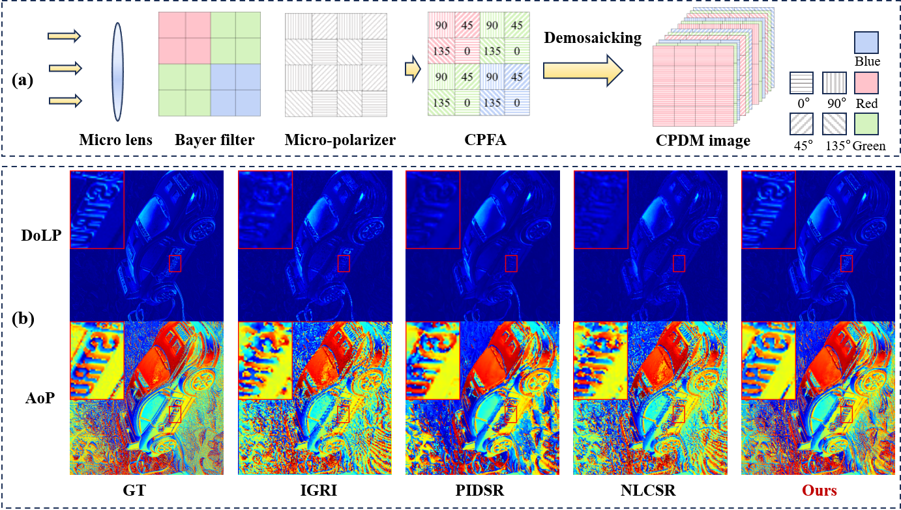

# DULR-CPDM
Authors: Caiyun Wu, Yidong Luo, Chenggong Li, Junchao Zhang*, Buge Liang

Affiliations:
- School of Automation, Central South University, Changsha 410083, China
- Hunan Provincial Key Laboratory of Optic-Electronic Intelligent Measurement and Control, Changsha 410083, China
- School of Engineering, Westlake University, Hangzhou 310030, China

* Corresponding author: Junchao Zhang (junchaozhang@csu.edu.cn)
  
Abstract:

The commonly used polarization images are obtained through snapshot polarization cameras, yet full-resolution images can only be achieved by performing color polarization demosaicking (CPDM). However, existing model-based algorithms face issues of excessive image smoothing and low computational efficiency due to their reliance on manual prior regularization and iterative solving. In contrast, deep learning methods often suffer from limited interpretability due to their black-box nature. To address these
challenges, we propose DULR-CPDM, a deep unfolding convolutional sparse coding (CSC) model that employs network-learned regularization for CPDM. This framework replaces handcrafted priors with two specialized network modules: a U-Net architecture that imposes adaptive constraints on sparse coding coefficients, and a Restormer-based network with transposed attention for dictionary atom refinement. The joint model-data-driven approach not only enhances the computational efficiency of the CSC model but also improves the network’s interpretability and generalization capability. Experimental results demonstrate that, compared to existing algorithms, DULR-CPDM offers significant advantages in recovering the Degree of Liner Polarization (DoLP) information and reducing the Angle of Polarization (AoP) artifacts in both indoor and outdoor test scenarios.

Keywords: color polarization demosaicking; color polarization imaging; sparse coding; deep unfolding.



DULR-CPDM offers significant advantages in DoLP texture preservation and AoP artifact reduction. 
(a) Imaging principle of a color DoFP camera integrating micro-lenses, a Bayer filter, and a micro-polarizer to capture color and polarization data in a single snapshot, followed by the CPDM result. 
(b) Comparisons with IGRI, PIDSR, and NLCSR are shown. "GT" denotes the corresponding ground-truth values.

## Features

- Training and testing for polarization datasets
- Automatic checkpoint saving and resume from the latest checkpoint
- Inference-time statistics during testing, including PSNR, SSIM, and AoP MAE
- Automatic saving of reconstructed outputs and visualizations

---

## Project Structure

```text
DULR-CPDM/
├── train_dulr.py              # Training entry point
├── test_dulr.py               # Testing entry point
├── options/                   # Training and testing configuration files
├── data/                      # Dataset loading and preprocessing
├── models/                    # Network architecture, loss functions, and inference logic
├── dataset/                   # Dataset directory
├── pretraind_net/             # Pretrained weights directory
├── debug/                     # Training and testing outputs
├── README.md
└── requirements.txt
```

---

## Requirements

Recommended environment:

- Python 3.9+
- PyTorch
- numpy
- pandas
- tqdm
- prettytable
- matplotlib
- opencv-python
- h5py
- polanalyser
- scipy
- thop

Install dependencies:

```bash
pip install numpy pandas tqdm prettytable matplotlib opencv-python h5py polanalyser scipy thop
```

If a `requirements.txt` file is provided, you can also install dependencies with:

```bash
pip install -r requirements.txt
```

Please install PyTorch from the official website according to your CUDA version.

---

## Quick Start

### 1. Install dependencies

```bash
pip install -r requirements.txt
```

If `requirements.txt` is not provided, install the packages listed in the Requirements section manually.

### 2. Download pretrained weights

Download the pretrained weights from Baidu Netdisk:

```text
File/folder name: pretraind_net
Link: https://pan.baidu.com/s/1Oixi9xz-tiKztYgIXhUvAQ?pwd=7f7b
Extraction code: 7f7b
```

Place the downloaded folder under:

```text
pretraind_net/
```

The pretrained model directory should contain the required model weights, such as:

```text
head_p.pth
pdm_x.pth
pdm_d.pth
hypa_p.pth
```

Before testing, make sure `path.pretrained_netG` in the testing configuration points to the correct pretrained model directory.

### 3. Train

```bash
python train_dulr.py -opt options/train_cpdm_s2.json
```

### 4. Test

```bash
python test_dulr.py -opt options/test_cpdm.json
```

---

## Dataset Preparation

The project uses polarization image data by default. The dataset mode is controlled by `data.type`, `real`, and `img_type` in the configuration file.

### 1. Standard image-folder mode

When `real=false` and `img_type=img`, each sample is usually a folder containing RGB images for different polarization angles. The file names should ideally contain one of the following angle tags:

```text
0 or _0
45 or _45
90 or _90
135 or _135
```

### 2. MAT-file mode

When `img_type=mat`, the loader reads `.mat` files and combines the following fields into a 12-channel input:

```text
RGB_0
RGB_45
RGB_90
RGB_135
```

### 3. Real single-channel mode

When `real=true`, the loader reads grayscale polarization images and converts them into a 12-channel representation.

### Example dataset structure

```text
dataset/
├── train/
│   ├── big/
│   └── small/
└── test/
    └── PIDSR_aug/
```

---

## Configuration Files

The main configuration files are stored in `options/`.

```text
options/train_cpdm_s1.json    # Training config using dataset/train/big
options/train_cpdm_s2.json    # Training config using dataset/train/small
options/test_cpdm.json        # Testing config, defaulting to dataset/test/PIDSR_aug
```

Before running the code, make sure the following fields match your environment:

```text
gpu_ids
path.root
path.pretrained_netG
data.train.dataroot_H
data.test.dataroot_H
data.test.save_path
```

---

## Training

The default training entry point is:

```bash
python train_dulr.py -opt options/train_cpdm_s2.json
```

After launching, the script will ask whether to continue the previous training session:

```text
Enter y: resume from debug/.../models/checkpoints/latest.pth
Enter anything else: start training from scratch
```

### Training Outputs

```text
debug/.../train/models/              # Saved model weights
debug/.../train/models/checkpoints/  # Training checkpoints
debug/.../train/log/                 # Training logs
debug/.../train/                     # Training visualizations
```

---

## Testing

The default testing entry point is:

```bash
python test_dulr.py -opt options/test_cpdm.json
```

### Testing Outputs

```text
debug/.../test/          # Visual results
test_visualization/      # Per-sample visualizations
debug/.../test/log/      # Testing logs
```

---

## Metrics

During testing, the script reports:

- Mean, minimum, maximum, and standard deviation of inference time
- Average FPS
- PSNR / SSIM for each polarization channel
- Stokes-related metrics
- DoLP metrics
- AoP MAE

### Important Note on Reported Metrics

The quantitative results reported below are recalculated from the saved output images using `cal_metrics.py` after image saving. Therefore, they may be slightly lower than the metrics computed directly by the built-in testing code during inference.

---

## Quantitative Results

Quantitative comparisons on three synthetic datasets of DULR-CPDM.

**Boldface indicates the best value.**

| Method | MQ S0 PSNR/SSIM ↑ | MQ DoLP PSNR/SSIM ↑ | MQ AoP MAE ↓ | PIDSR S0 PSNR/SSIM ↑ | PIDSR DoLP PSNR/SSIM ↑ | PIDSR AoP MAE ↓ | OPID S0 PSNR/SSIM ↑ | OPID DoLP PSNR/SSIM ↑ | OPID AoP MAE ↓ |
|---|---:|---:|---:|---:|---:|---:|---:|---:|---:|
| IGRI | 42.06/0.9798 | 33.42/0.8692 | 12.70 | 43.04/0.9774 | 35.26/0.8643 | 15.01 | 40.61/0.9800 | 27.73/0.7738 | 9.12 |
| NLCSR | 38.80/0.9687 | 34.10/0.8635 | 12.24 | 39.93/0.9585 | 37.91/0.8789 | 12.83 | 37.58/0.9662 | 26.80/0.7402 | 9.32 |
| TCPDNet | 44.06/0.9841 | 36.06/0.8921 | 10.22 | 44.37/0.9801 | 39.13/0.8883 | 12.75 | 39.38/0.9768 | 26.66/0.7322 | 10.59 |
| PIDSR | 42.54/0.9753 | 35.00/0.8681 | 11.40 | 43.88/0.9821 | 39.27/0.8914 | 12.07 | 41.29/0.9835 | 29.37/0.8209 | 7.69 |
| DCPM | 44.15/0.9837 | 35.15/0.8788 | 11.71 | 44.96/0.9821 | 38.43/0.8791 | 13.49 | 43.04/0.9846 | 29.74/0.8217 | 8.38 |
| NAFNet | 44.88/0.9856 | 36.46/0.8874 | 10.75 | 47.04/0.9892 | 39.28/0.8816 | 12.30 | 43.75/**0.9875** | 30.12/0.8330 | 8.81 |
| Ours | **45.45/0.9884** | **37.31/0.9019** | **9.81** | **47.21/0.9900** | **39.90/0.8935** | **11.15** | **44.01**/0.9871 | **30.89/0.8481** | **7.17** |

---

## Pretrained Models

The pretrained weights are shared through Baidu Netdisk:

```text
File/folder name: pretraind_net
Link: https://pan.baidu.com/s/1Oixi9xz-tiKztYgIXhUvAQ?pwd=7f7b
Extraction code: 7f7b
```

After downloading, place the pretrained weights in:

```text
pretraind_net/
```

Then update the following field in the testing configuration file:

```json
"path": {
    "pretrained_netG": "pretraind_net/..."
}
```

---

## Common Issues

### 1. Pretrained weights not found

Please check whether `path.pretrained_netG` is correct and whether the pretrained directory contains the required `.pth` files.

### 2. Data loading fails

Please check:

- Whether the dataset path is correct
- Whether the dataset directory follows the expected structure
- Whether the file names contain valid polarization angle tags
- Whether `real` and `img_type` are correctly configured

## Notes

This project focuses on polarization image restoration. Training and testing are integrated into the scripts, and the main configuration is stored under [options/](options).

## Attribution
This project is based on DCDicL_denoising by Nate Zheng (Hongyi Zheng). Original repository: https://github.com/natezhenghy/DCDicL_denoising. See the original repo for full authorship and license information.
